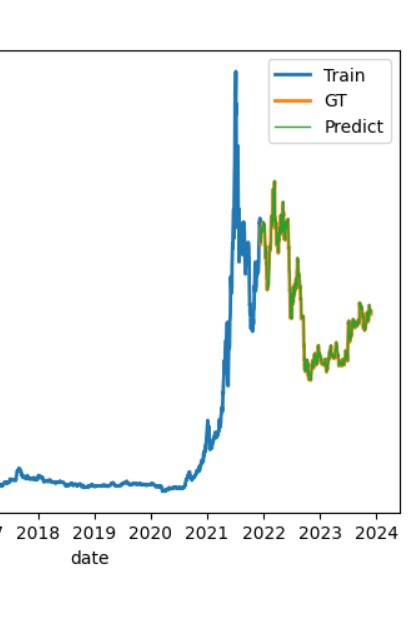
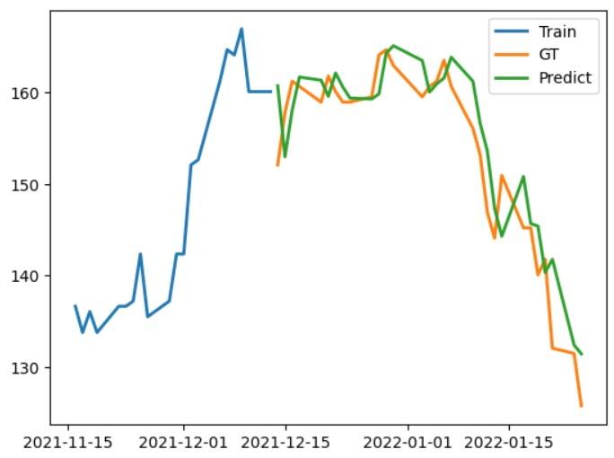
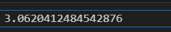

# LSTM briefly introduction
LSTM（Long Short-Term Memory）是一種常用於處理序列數據的神經網路架構，特別是在自然語言處理（NLP）和時間序列領域。

LSTM 由循環神經網路（RNN）演變而來，主要解決了 RNN 在處理長期依賴關係時的問題。在 RNN 中，長期依賴的信息往往會由於梯度消失或梯度爆炸的問題而難以有效地被傳遞和記憶。而 LSTM 通過引入門控機制來解決這個問題，主要包括遺忘門、輸入門和輸出門，這些門控機制可以控制信息的流動和遺忘，從而更有效地長期保留重要的信息。

"# LSTM_STOCK_Prediction" 
優點：

處理時間序列特徵： LSTM 對時間序列數據具有良好的建模能力，可以捕捉股票價格和交易量等時間序列特徵之間的關係。
長期依賴記憶： LSTM 的結構使得它能夠有效地處理長期依賴關係，這對於股票市場中存在的複雜動態模式和趨勢具有重要意義。
非線性建模： LSTM 是一種強大的非線性模型，可以擬合各種複雜的股票價格模式，從而提高預測準確性。
可適應性： LSTM 網絡可以通過調整不同的超參數（如神經元數量、學習率等）來應對不同的股票市場和時間尺度。

缺點：

過度擬合： LSTM 可能會在訓練過程中過度擬合訓練數據，導致在新數據上的泛化性能不佳。
數據需求： LSTM 需要大量的歷史數據來訓練，而且需要高質量的數據源，以確保模型的準確性和穩定性。
非靜態模型： LSTM 需要不斷地調整和優化模型參數，以應對不斷變化的市場環境和股票價格模式。
不確定性： 股票市場具有高度不確定性，LSTM 預測的準確性受到許多因素的影響，包括宏觀經濟、政治事件等。

# Stock in Taiwan
This project use sidling window of 60 of x to generate one y.

# CVRMSE / RMSE

